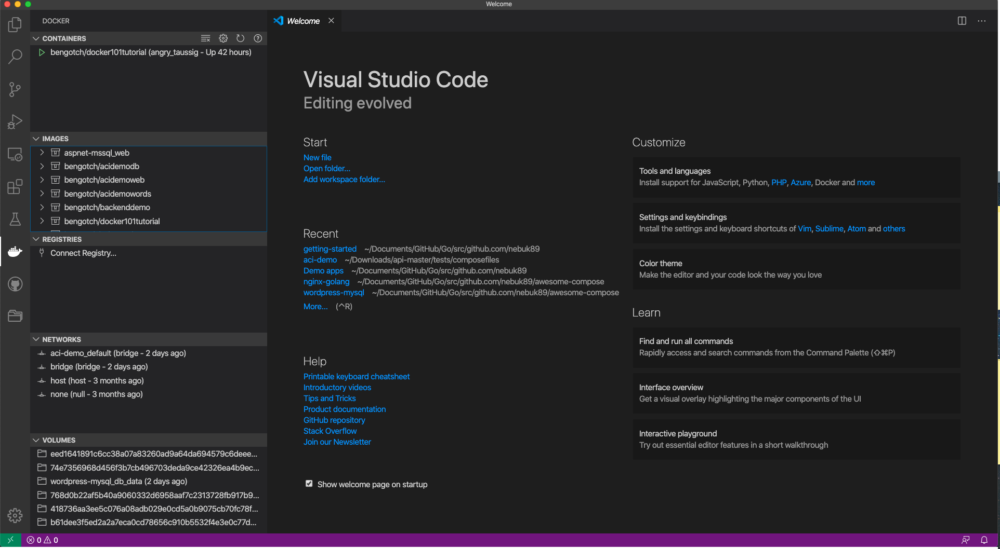

# Tutorial: Get started with Docker

In this tutorial, you'll learn about creating and deploying Docker apps, including using multiple containers with a database, and using Docker Compose. You'll also deploy your containerized app to Azure.

## Start the tutorial

If you've already run the command to get started with the tutorial, congratulations!  If not, open a command prompt or bash window, and run the command:

```cli
docker run -d -p 80:80 docker/getting-started
```

You'll notice a few flags being used. Here's some more info on them:

- `-d` - run the container in detached mode (in the background)
- `-p 80:80` - map port 80 of the host to port 80 in the container
- `docker/getting-started` - the image to use

> [!TIP]
> You can combine single character flags to shorten the full command.
> As an example, the command above could be written as:
>
> ```cli
> docker run -dp 80:80 docker/getting-started
> ```

## The VS Code Extension

Before going too far, we want to highlight the Docker VS Code Extension, which gives you a quick view of the containers running on your machine. It gives you quick
access to container logs, lets you get a shell inside the container, and lets you easily manage container lifecycle (stop, remove, and so on).

To access the extension, follow the instructions [here](https://code.visualstudio.com/docs/containers/overview). If you open the extension
now, you will see this tutorial running! The container name (`angry_taussig` below) is a randomly created name. So, you'll most likely have a different name.



## What is a container

Now that you've run a container, what *is* a container? Simply put, a container is simply another process on your machine that has been isolated from all other processes on the host machine. That isolation leverages [kernel namespaces and cgroups](https://medium.com/@saschagrunert/demystifying-containers-part-i-kernel-space-2c53d6979504), features that have been in Linux for a long time. Docker has worked to make these capabilities approachable and easy to use.

> [!NOTE]
> **Creating Containers from Scratch**
> If you'd like to see how containers are built from scratch, Liz Rice from Aqua Security has a video in which she creates a container from scratch in Go:
>
> [!VIDEO https://www.youtube-nocookie.com/embed/8fi7uSYlOdc]

## What is a container image

When running a container, it uses an isolated filesystem. This custom filesystem is provided by a **container image**. Since the image contains the container's filesystem, it must contain everything needed to run an application - all dependencies, configuration, scripts, binaries, and so on. The image also contains other configuration for the container, such as environment variables, a default command to run, and other metadata.

We'll dive deeper into images later on, covering topics such as layering, best practices, and more.

> [!NOTE]
> If you're familiar with `chroot`, think of a container as an extended version of `chroot`. The filesystem is simply coming from the image. But, a container adds additional isolation not available when simply using chroot.

## Next steps

Continue with the tutorial!

> [!div class="nextstepaction"]
> [Our application](your-application.md)
