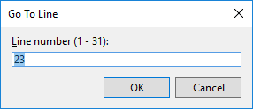

# Go To Line dialog box

The **Go To Line** dialog box lets you move to a specific line in the active document. To access this dialog box, open a document for editing, and then select **Edit** > **Go To** > **Go To Line** or press **Ctrl**+**G**.

## Line number (1 - \<n>)

In the **Line number (1 - \<n>)** box, enter the number of the line in the active document that you want to move to. The number entered must fall between 1 and the last line number in the current document.

## See also

- [Find code using Go To commands](../../ide/go-to.md)
- [Set bookmarks in code](../../ide/setting-bookmarks-in-code.md)
- [Find and replace text](../../ide/finding-and-replacing-text.md)
- [Features of the code editor](../../ide/writing-code-in-the-code-and-text-editor.md)
