# Deploying a Visual Studio Tools for Office Solution Using Windows Installer

## Summary

Learn how to deploy a Microsoft Visual Studio Tools for Office (VSTO) add-in or document-level solution using a Visual Studio Installer project.

Wouter van Vugt, Code Counsel

Ted Pattison, Ted Pattison Group

This article was updated by Microsoft with permission from the original authors.

**Applies to:** Visual Studio Tools for Office, Microsoft Office, Microsoft Visual Studio.

## Overview

You can develop a VSTO solution and deploy the solution by using a Windows Installer package. This discussion includes steps for deploying a simple Office Add-in.

## Deployment Methods

ClickOnce can easily be used to create setups for your Add-ins and solutions. However, it can't install Add-ins that require administrative privileges such as machine level Add-ins.

Add-ins that require administrative privileges can be installed by using Windows Installer but it does require more effort to create the setup.

For an overview of how to deploy a VSTO solution using ClickOnce, see [Deploy an Office solution by using ClickOnce](deploying-an-office-solution-by-using-clickonce.md).

## Deploying Office solutions that target the VSTO runtime

ClickOnce and Windows Installer packages need to do the same rudimentary tasks when installing an Office solution.

1. Install prerequisite components on the user computer.
2. Deploy the specific components for the solution.
3. For Add-ins, create registry entries.
4. Trust the solution to allow it to execute.

### Required Prerequisite Components on the Target Computer

Here's the list of software that must be installed on the computer to run VSTO solutions:

- Microsoft Office 2010 or newer.
- The Microsoft .NET Framework 4 or newer.
- The Microsoft Visual Studio 2010 Tools for Office Runtime.
  The runtime provides an environment that manages Add-ins and document-level solutions. A version of the Runtime does ship with Microsoft Office but you may want to redistribute a specific version with your add-in.
- The Primary Interop assemblies for Microsoft Office, if you're not using Embedded Interop Types.
- Any utilities assemblies referenced by projects.

### Specific Components for the Solution

The installer package must install these components to the user's computer:

- The Microsoft Office document, if you create a document-level solution.
- The customization assembly and any assemblies it requires.
- Additional components such as configuration files.
- The application manifest (.manifest).
- The deployment manifest (.vsto).

### Registry Entries for Add-ins

Microsoft Office uses registry entries to locate and load Add-ins. These registry entries should be created as part of the deployment process. For more information about these registry entries, see [Registry entries for VSTO Add-ins](registry-entries-for-vsto-add-ins.md).

Outlook Add-ins that display custom form regions require additional registry entries that allow the form regions to be identified. For more information about registry entries, see [Registry entries for Outlook form regions](registry-entries-for-vsto-add-ins.md#OutlookEntries).

Document-level solutions don't require any registry entries. Instead, properties inside the document are used to locate the customization. For more information about these properties, see [Custom Document Properties Overview](custom-document-properties-overview.md).

### Trusting the VSTO Solution

In order for a customization to run, a solution must be trusted by the machine. The Add-in can be trusted by signing the manifest with a certificate, creating a trust-relationship with an inclusion list, or by installing it to a trusted location on the machine.

For more information about how to obtain a certificate for signing, see [ClickOnce Deployment and Authenticode](../deployment/clickonce-and-authenticode.md). For more information about trusting solutions, see [Trusting Office Solutions by Using Inclusion Lists](trusting-office-solutions-by-using-inclusion-lists.md). You can add an inclusion list entry with a custom action in your Windows Installer file. For more information about enabling the inclusion list, see [How to: Configure Inclusion List Security](how-to-configure-inclusion-list-security.md).

If neither option is used, a trust prompt is displayed to the user to let them decide whether to trust the solution.

For more information about security related to document-level solutions, see [Granting Trust to Documents](granting-trust-to-documents.md).

## Creating a Basic Installer

The Setup and Deployment project templates are included with the [Microsoft Visual Studio Installer Projects](https://marketplace.visualstudio.com/items?itemName=visualstudioclient.MicrosoftVisualStudio2017InstallerProjects) extension that is available for download.

To create an installer for an Office solution, these tasks must be accomplished:

- Add the components of the Office Solution that will be deployed.
- For application-level Add-ins, configure registry keys.
- Configure prerequisite components so they can be installed on the end-users computers.
- Configure launch conditions to verify that the required prerequisite components are available. Launch conditions can be used to block the install if all required prerequisites are not installed.

The first step is to create the setup project.

### To create the AddIn Setup project

1. Open the Office AddIn Project you want to deploy. For this example, we're using an Excel Add-in called ExcelAddIn.
2. With the Office Project Open, on the **File** menu, expand **Add** and click **New Project** to add a new project.
::: moniker range="=vs-2017"
3. In the **Add New Project** dialog, expand **Other Project Types** in **the Project types** pane, then expand **Setup and Deployment** and then select **Visual Studio Installer**.
4. In the **Templates** pane, select **Setup Project** from the **Visual Studio installed** templates group.
::: moniker-end
::: moniker range="=vs-2019"
3. On the **Add a New Project** dialog, select the **Setup Project** template.
4. Click **Next**.
::: moniker-end

5. In the **Name** box, type **OfficeAddInSetup**.
::: moniker range="=vs-2017"
6. Click **Open** to create the new setup project.
::: moniker-end
::: moniker range="=vs-2019"
6. Click **Create** to create the new setup project.
::: moniker-end

Visual Studio opens the File System Explorer for the new setup project. The File System Explorer allows you to add files to the setup project.

   

   **Figure 1: File System Explorer for the setup project**

The setup project needs to deploy the ExcelAddIn. You can configure the setup project for this task by adding the ExcelAddIn project output to the setup project.

### To add the ExcelAddIn project output

1. In the **Solution Explorer**, right-click **OfficeAddInSetup**, click **Add** and then **Project Output**.
2. In the **Add Project Output Group** dialog, select the **ExcelAddIn** from the project list, and **Primary Output**.
3. Click **OK** to add the project output to the setup project.

    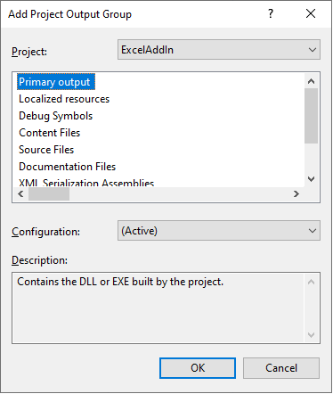

    **Figure 2: Setup Project Add Project Output Group dialog**

The setup project needs to deploy the deployment manifest and application manifest. Add these two files to the setup project as stand-alone files from the output folder of the ExcelAddIn project.

### To add the deployment and application manifests

1. In the **Solution Explorer**, right-click **OfficeAddInSetup**, click **Add**, and click **File**.
2. In the **Add Files** dialog box, navigate to the **ExcelAddIn** output directory. Usually the output directory is the **bin\\release** subfolder of the project root directory, depending on the selected build configuration.
3. Select the **ExcelAddIn.vsto** and **ExcelAddIn.dll.manifest** files and click **Open** to add these two files to the setup project.

    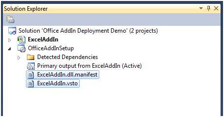

    **Figure 3: Application and deployment manifests for the Add-in in Solution Explorer**

Referencing the ExcelAddIn includes all the components that ExcelAddIn requires. These components must be excluded and deployed using prerequisite packages to allow them to be registered correctly. Also, the Software License Terms must be displayed and accepted before the installation begins.

### To exclude the ExcelAddIn project dependencies

1. In the **Solution Explorer**, in the **OfficeAddInSetup** node, select all dependency items beneath the **Detected Dependencies** item except for **Microsoft .NET Framework** or any assembly that ends with **\*.Utilities.dll**. The Utilities assemblies are meant to be deployed along with your application.
2. Right-click the group and select **Properties**.
3. In the **Properties** window, change the **Exclude** property to **True** to exclude the dependent assemblies from the setup project. Make sure to not exclude any Utilities assemblies.

    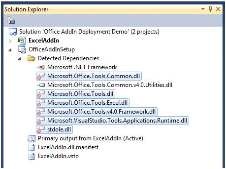

    **Figure 4: Excluding dependencies**

You can configure your Windows Installer package to install prerequisite components by adding a Setup program, also known as a bootstrapper. This setup program can install the prerequisite components, a process called bootstrapping.

For the **ExcelAddIn**, these prerequisites must be installed before the Add-in can run correctly:

- The Microsoft .NET Framework version that the Office Solution targets.
- Microsoft Visual Studio 2010 Tools for Office Runtime.

To configure dependent components as prerequisites

1. In the **Solution Explorer**, right-click the **OfficeAddInSetup** project and select **Properties**.
2. The **OfficeAddInSetup Property Pages** dialog box appears.
3. Click the **Prerequisites** button.
4. In the Prerequisites dialog box, select the correct version of the .NET Framework and the Microsoft Visual Studio Tools for Office Runtime.

    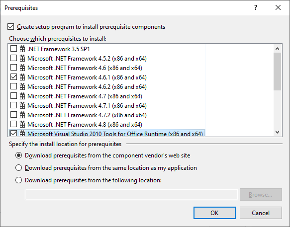

    **Figure 5: Prerequisites Dialog Box**

    > [!NOTE]
    >Some of the configured prerequisite packages in your Visual Studio Setup Project are dependent on the selected build configuration. You must select the right prerequisite components for each build configuration that you use.

Microsoft Office locates Add-ins by using registry keys. The keys in the HKEY\_CURRENT\_USER hive are used to register the add-in for each individual user. The keys under the HKEY\_LOCAL\_MACHINE hive are used to register the add-in for all users of the machine. For more information about registry keys, see [Registry entries for VSTO Add-ins](registry-entries-for-vsto-add-ins.md).

### To configure the registry

1. In the **Solution Explorer**, right-click **OfficeAddInSetup**.
2. Expand **View**.
3. Click **Registry** to open the registry editor window.
4. In the **Registry(OfficeAddInSetup)** editor, expand **HKEY\_LOCAL\_MACHINE** and then **Software**.
5. Delete the **\[Manufacturer\]**?key found under **HKEY\_LOCAL\_MACHINE\\Software**.
6. Expand **HKEY\_CURRENT\_USER** and then **Software**.
7. Delete the **\[Manufacturer\]** key found under **HKEY\_CURRENT\_USER\\Software**.
8. To add registry keys for the add-in installation right-click the **User/Machine Hive** key, select **New Key**. Use the text **Software** for the name of the new key. Right-click on the newly created **Software** key and create a new key with the text **Microsoft**.
9. Use a similar process to create the entire key hierarchy required for the add-in registration:

    **User/Machine Hive\\Software\\Microsoft\\Office\\Excel\\Addins\\SampleCompany.ExcelAddIn**

    The Company Name is often used as a prefix for the name of the add-in to provide uniqueness.

10. Right-click the **SampleCompany.ExcelAddIn** key, select **New**, and click **String value**. Use the text
**Description** for the Name.
11. Use this step to add three more values:
    - **FriendlyName** of type **String**
    - **LoadBehavior** of type **DWORD**
    - **Manifest** of type **String**

12. Right-click the **Description** value in the registry editor and click **Properties Window**. In the **Properties Window**, enter **Excel Demo AddIn** for the Value property.
13. Select the **FriendlyName** key in the registry editor. In the **Properties Window**, change the **Value** property to **Excel Demo AddIn**.
14. Select the **LoadBehavior** key in the registry editor. In the **Properties Window**, change the **Value** property to **3.** The value 3 for the LoadBehavior indicates that the add-in should be loaded at startup of the host application. For more information about load behavior, see [Registry entries for VSTO Add-ins](registry-entries-for-vsto-add-ins.md).

15. Select the **Manifest** key in the registry editor. In the **Properties Window**, change the **Value** property to **file:///[TARGETDIR]ExcelAddIn.vsto|vstolocal**

    

    **Figure 6: Setting up registry keys**

      The VSTO runtime uses this registry key to locate the deployment manifest. The [TARGETDIR] macro will be replaced with the folder where the add-in is installed to. The macro will include the trailing \ character, so the filename of the deployment manifest should be ExcelAddIn.vsto without the \ character.
      The **vstolocal** postfix, tells the VSTO runtime that the Add-in should load from this location instead of the ClickOnce cache. Removing this postfix will cause the runtime to copy the customization into the ClickOnce cache.

   >[!WARNING]
   >You should be very careful with the Registry Editor in Visual Studio. For example, if you accidentally set DeleteAtUninstall for the wrong key, you might delete an active part of the registry, leaving the user computer in an inconsistent, or even worse, broken state.

64-bit versions of Office will use the 64-bit registry hive to look for Add-ins. To register Add-ins under the 64-bit registry hive, the setup project's target platform must be set to 64-bit only.

1. Select the **OfficeAddInSetup** project in solution explorer.
2. Go to **Properties** window and set **TargetPlatform** property to **x64**.

Installing an Add-in for both 32-bit and 64-bit versions of Office, will require you to create two separate MSI packages. One for 32-bit and one for 64-bit.

  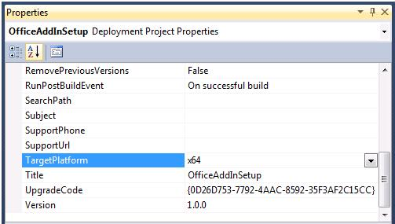

  **Figure 7: Target Platform for registering Add-ins with 64-bit Office**

If the MSI package is used to install the Add-in or solution, it may install without the required prerequisites being installed. You can use Launch Conditions in the MSI to block the Add-in from installing if the prerequisites are not installed.

### Configure a launch condition to detect the VSTO Runtime

1. In the **Solution Explorer**, right-click **OfficeAddInSetup**.
2. Expand **View**.
3. Click **Launch Conditions**.
4. In the **Launch Conditions(OfficeAddInSetup)** editor, right-click **Requirements on Target Machine**, and then click **Add Registry Launch Condition**. This search condition can search the registry for a key that the VSTO runtime installs. The value of the key is then available to the various pieces of the installer through a named property. The launch condition uses the property defined by the search condition to check for a certain value.
5. In the **Launch Conditions(OfficeAddInSetup)** editor, select the **Search for RegistryEntry1** search condition, right-click the condition, and select **Properties Window**.

6. In the **Properties** window, set these properties:
   1. Set the value of **(Name)** to **Search for VSTO 2010 Runtime**.
   2. Change the value of **Property** to **VSTORUNTIMEREDIST**.
   3. Set the value of **RegKey** to **SOFTWARE\\Microsoft\\VSTO Runtime Setup\\v4R**
   4. Leave the **Root** property set to **vsdrrHKLM**.
   5. Change the **Value** property to **Version**.

7. In the **Launch Conditions(OfficeAddInSetup)** editor, select the **Condition1** launch condition, right-click the condition, and select **Properties Window**.
8. In the Properties window, set these properties:
   1. Set the **(Name)** to **Verify VSTO 2010 Runtime availability**.
   2. Change the value of the **Condition** to **VSTORUNTIMEREDIST\>="10.0.30319"**
   3. Leave the **InstallURL** property blank.
   4. Set the **Message** to **The Visual Studio 2010 Tools for Office Runtime is not installed. Please run Setup.exe to install the Add-in**.

        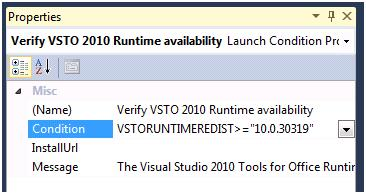

        **Figure 8: Properties Window for the Verify Runtime Availability launch condition**

 The launch condition above explicitly checks for the presence of the VSTO runtime when it's installed by the bootstrapper package.

### Configure a launch condition to detect the VSTO Runtime installed by Office

1. In the **Launch Conditions(OfficeAddInSetup)** editor, right-click **Search Target Machine**, and then click **Add Registry Search**.
2. Select the **Search for RegistryEntry1** search condition, right-click the condition, and select **Properties Window**.
3. In the **Properties** window, set these properties:
    1. Set the value of **(Name)** to **Search for Office VSTO Runtime**.
    2. Change the value of **Property** to **OfficeRuntime**.
    3. Set the value of **RegKey** to **SOFTWARE\\Microsoft\\VSTO Runtime Setup\\v4**.
    4. Leave the **Root** property set to **vsdrrHKLM**.
    5. Change the **Value** property to **Version**.

4. In the **Launch Conditions(OfficeAddInSetup)** editor, select the **Verify VSTO 2010 Runtime availability** launch condition defined earlier, right-click the condition, and select **Properties Window**.

5. Change the value of the **Condition** property to **VSTORUNTIMEREDIST \>="10.0.30319" OR OFFICERUNTIME\>="10.0.21022"**. The version numbers maybe different for you depending on the versions of the runtime that your Add-in requires.

    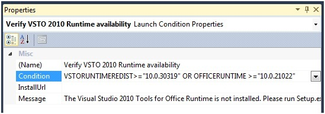
  
    **Figure 9: Properties Windows for the Verify Runtime Availability through Redist or Office launch condition**

If an Add-in targets .NET Framework 4, or newer, the Types inside the Primary Interop Assemblies (PIA), that are referenced, can be embedded into the VSTO assembly.

To check if the Interop Types will be embedded in your Add-in by performing the following steps:

1. Expand the References Node in Solution Explorer
2. Select one of the PIA references, for example, **Office**.
3. View the properties windows by hitting F4 or selecting Properties from the Assemblies context menu.
4. Check the value of the property **Embed Interop Types**.

If the value is set to **True**, then the Types are being embedded and you can skip down to the [**To build the setup project**](#to-build-the-setup-project) section.

For more information, see [Type Equivalence and Embedded Interop Types](/dotnet/framework/interop/type-equivalence-and-embedded-interop-types)

### To configure launch conditions to detect that for Office PIAs

1. In the **Launch Conditions(OfficeAddInSetup)** editor, right-click **Requirements on Target Machine**,
    and then **click Add Windows Installer Launch Condition**. This launch condition searches for an Office PIA by searching for the specific component ID.
2. Right-click **Search for Component1** and click **Properties Window** to show the properties of the launch condition.
3. In the **Properties Window**, set these properties:

    1. Change the value of the **(Name)** property to **Search for Office Shared PIA**
    2. Change the value of the **ComponentID** to Component Id for the Office component you're using. You can find the list of Component Ids in the table below, for example **{64E2917E-AA13-4CA4-BFFE-EA6EDA3AFCB4}**.
    3. Change the value of the **Property** property to **HASSHAREDPIA**.

4. In the **Launch Conditions(OfficeAddInSetup)** editor, right-click **Condition1** and click **Properties Window** to show the properties of the launch condition.

5. Change these properties of **Condition1**:

    1. Change the **(Name)** to **Verify Office Shared PIA availability**.
    2. Change the **Condition** to **HASSHAREDPIA**.
    3. Leave **InstallUrl** blank.
    4. Change the **Message** to **A required component for interacting with Excel is not available. Please run setup.exe**.

    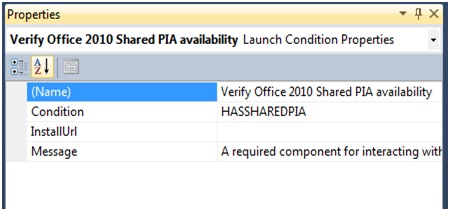
  
    **Figure 10: Properties Window for the Verify Office Shared PIA launch condition**

### Component IDs of the Primary Interop Assemblies for Microsoft Office

|Primary interop assembly|Office 2010|Office 2013|Office 2013 (64-bit)|Office 2016|Office 2016 (64-bit)|
|------------------------|------------------------|------------------------|------------------------|------------------------|------------------------|
|Excel|{EA7564AC-C67D-4868-BE5C-26E4FC2223FF}|{C8A65ABE-3270-4FD7-B854-50C8082C8F39}|{E3BD1151-B9CA-4D45-A77E-51A6E0ED322A}|C4ACE6DB-AA99-401F-8BE6-8784BD09F003}|{C4ACE6DB-AA99-401F-8BE6-8784BD09F003}|
|InfoPath|{4153F732-D670-4E44-8AB7-500F2B576BDA}|{0F825A16-25B2-4771-A497-FC8AF3B355D8}|{C5BBD36E-B320-47EF-A512-556B99CB7E41}|-|-|
|Outlook|{1D844339-3DAE-413E-BC13-62D6A52816B2}|{F9F828D5-9F0B-46F9-9E3E-9C59F3C5E136}|{7824A03F-28CC-4371-BC54-93D15EFC1E7F}|{7C6D92EF-7B45-46E5-8670-819663220E4E}|{7C6D92EF-7B45-46E5-8670-819663220E4E}|
|PowerPoint|{EECBA6B8-3A62-44AD-99EB-8666265466F9}|{813139AD-6DAB-4DDD-8C6D-0CA30D073B41}|{05758318-BCFD-4288-AD8D-81185841C235}|{E0A76492-0FD5-4EC2-8570-AE1BAA61DC88}|{E0A76492-0FD5-4EC2-8570-AE1BAA61DC88}|
|Visio|{3EA123B5-6316-452E-9D51-A489E06E2347}|{C1713368-12A8-41F1-ACA1-934B01AD6EEB}|{2CC0B221-22D2-4C15-A9FB-DE818E51AF75}|{2D4540EC-2C88-4C28-AE88-2614B5460648}|{2D4540EC-2C88-4C28-AE88-2614B5460648}|
|Word|{8B74A499-37F8-4DEA-B5A0-D72FC501CEFA}|{9FE736B7-B1EE-410C-8D07-082891C3DAC8}|{13C07AF5-B206-4A48-BB5B-B8022333E3CA}|{DC5CCACD-A7AC-4FD3-9F70-9454B5DE5161}|{DC5CCACD-A7AC-4FD3-9F70-9454B5DE5161}|
|Microsoft Forms 2.0|{B2279272-3FD2-434D-B94E-E4E0F8561AC4}|{B2279272-3FD2-434D-B94E-E4E0F8561AC4}|{A5A30117-2D2A-4C5C-B3C8-8897AC32C2AC}|-|-|
|Microsoft Graph|{011B9112-EBB1-4A6C-86CB-C2FDC9EA7B0E}|{52DA4B37-B8EB-4B7F-89C1-824654CE4C70}|{24706F33-F0CE-4EB4-BC91-9E935394F510}|-|-|
|Smart Tag|{7102C98C-EF47-4F04-A227-FE33650BF954}|{487A7921-EB3A-4262-BB5B-A5736B732486}|{74EFC1F9-747D-4867-B951-EFCF29F51AF7}|-|-|
|Office Shared|{64E2917E-AA13-4CA4-BFFE-EA6EDA3AFCB4}|{6A174BDB-0049-4D1C-86EF-3114CB0C4C4E}|{76601EBB-44A7-49EE-8DE3-7B7B9D7EBB05}|{625F5772-C1B3-497E-8ABE-7254EDB00506}|{625F5772-C1B3-497E-8ABE-7254EDB00506}|
|Project|{957A4EC0-E67B-4E86-A383-6AF7270B216A}|{1C50E422-24FA-44A9-A120-E88280C8C341}|{706D7F44-8231-489D-9B25-3025ADE9F114}|{107BCD9A-F1DC-4004-A444-33706FC10058}|{107BCD9A-F1DC-4004-A444-33706FC10058}|

  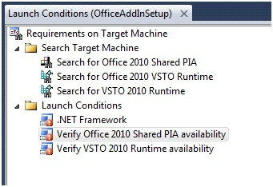

  **Figure 11: Final launch conditions**

You can further refine the launch conditions for the ExcelAddIn installation. For instance, it maybe useful to check if the actual target Office application is installed.

### To build the setup project

1. In the **Solution Explorer**, right-click the **OfficeAddInSetup** project and click **Build**.
2. Using **Windows Explorer**, navigate to the output directory of the **OfficeAddInSetup** project and go to the Release or Debug folder, depending on the selected build configuration. Copy all files from the folder to a location that users can access.

To Test the ExcelAddIn setup

1. Navigate to the location where you copied **OfficeAddInSetup** to.
2. Double-click on the setup.exe file to install the **OfficeAddInSetup** add-in. Accept any Software License Terms that appear, and complete the setup wizard to install the add-in on the user computer.

The Excel Office solution should install and run from the location specified during setup.

## Additional Requirements for Document-level Solutions

Deploying document-level solutions require a few different configuration steps in the Windows Installer setup project.

Here's a list of basic steps required to deploy a document-level solution:

- Create the Visual Studio Setup Project.
- Add the primary output of your document-level solution. The primary output also includes the Microsoft Office document.
- Add the deployment and application manifests as loose files.
- Exclude the dependent components from the installer package (except for any utilities assemblies).
- Configure prerequisite packages.
- Configure launch conditions.
- Build the setup project and copy the results to the deployment location.
- Deploy the document-level solution on the user computer by executing the setup.
- Update the custom document properties if needed.

### Changing the Location of the Deployed Document

Properties inside an Office document are used to locate document level solutions. If the document is installed to the same folder as the VSTO assembly, no changes are required. However, if it's installed to different folder, these properties will need to be updated during the setup.

For more information about these document properties, see [Custom Document Properties Overview](custom-document-properties-overview.md).

To change these properties, you need to use a custom action during the setup.

The following example uses a document-level solution called ExcelWorkbookProject and a setup project called ExcelWorkbookSetup. The ExcelWorkbookSetup project is configured by using the same steps outlined above, except for setting the registry keys.

To add the custom action project to your Visual Studio solution

1. Add a new .NET Console project to the solution by right clicking the **Office Document Deployment Project** in the **Solution Explorer**
2. Expand **Add** and click **New Project**.
3. Select the Console App template and name the project **AddCustomizationCustomAction**.

    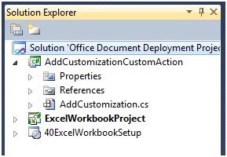
  
    **Figure 12: Solution Explorer - AddCustomizationCustomAction**

4. Add a Reference to these assemblies:
    1. System.ComponentModel
    2. System.Configuration.Install
    3. Microsoft.VisualStudio.Tools.Applications
    4. Microsoft.VisualStudio.Tools.Applications.ServerDocument

5. Copy this code into Program.cs or Program.vb

```csharp
    using System;
    using System.IO;
    using System.Collections;
    using System.ComponentModel;
    using System.Configuration.Install;
    using Microsoft.VisualStudio.Tools.Applications;
    using Microsoft.VisualStudio.Tools.Applications.Runtime;

    namespace AddCustomizationCustomAction
    {
        [RunInstaller(true)]
        public class AddCustomizations : Installer
        {
            public AddCustomizations() : base() { }

            public override void Install(IDictionary savedState)
            {
                base.Install(savedState);

                //Get the CustomActionData Parameters
                string documentLocation = Context.Parameters.ContainsKey("documentLocation") ? Context.Parameters["documentLocation"] : String.Empty;
                string assemblyLocation = Context.Parameters.ContainsKey("assemblyLocation") ? Context.Parameters["assemblyLocation"] : String.Empty;
                string deploymentManifestLocation = Context.Parameters.ContainsKey("deploymentManifestLocation") ? Context.Parameters["deploymentManifestLocation"] : String.Empty;
                Guid solutionID = Context.Parameters.ContainsKey("solutionID") ? new Guid(Context.Parameters["solutionID"]) : new Guid();

                string newDocLocation = Path.Combine(Environment.GetFolderPath(Environment.SpecialFolder.MyDocuments), Path.GetFileName(documentLocation));

                try
                {
                    //Move the file and set the Customizations
                    if (Uri.TryCreate(deploymentManifestLocation, UriKind.Absolute, out Uri docManifestLocationUri))
                    {
                        File.Move(documentLocation, newDocLocation);
                        ServerDocument.RemoveCustomization(newDocLocation);
                        ServerDocument.AddCustomization(newDocLocation, assemblyLocation,
                                                        solutionID, docManifestLocationUri,
                                                        true, out string[] nonpublicCachedDataMembers);
                    }
                    else
                    {
                        LogMessage("The document could not be customized.");
                    }
                }
                catch (ArgumentException)
                {
                    LogMessage("The document could not be customized.");
                }
                catch (DocumentNotCustomizedException)
                {
                    LogMessage("The document could not be customized.");
                }
                catch (InvalidOperationException)
                {
                    LogMessage("The customization could not be removed.");
                }
                catch (IOException)
                {
                    LogMessage("The document does not exist or is read-only.");
                }
            }

            public override void Rollback(IDictionary savedState)
            {
                base.Rollback(savedState);
                DeleteDocument();
            }
            public override void Uninstall(IDictionary savedState)
            {
                base.Uninstall(savedState);
                DeleteDocument();
            }
            private void DeleteDocument()
            {
                string documentLocation = Context.Parameters.ContainsKey("documentLocation") ? Context.Parameters["documentLocation"] : String.Empty;

                try
                {
                    File.Delete(Path.Combine(Environment.GetFolderPath(Environment.SpecialFolder.MyDocuments), Path.GetFileName(documentLocation)));
                }
                catch (Exception)
                {
                    LogMessage("The document doesn't exist or is read-only.");
                }
            }
            private void LogMessage(string Message)
            {
                if (Context.Parameters.ContainsKey("LogFile"))
                {
                    Context.LogMessage(Message);
                }
            }

            static void Main() { }
            }
    }
```

To add the customization to the document, you need to have the solution ID of your VSTO document-level solution. This value is retrieved from the Visual Studio project file.

To retrieve the solution ID

1. On the **Build** menu, click **Build Solution** to build the document-level solution and add the solution ID property to the project file.
2. In the **Solution Explorer**, right-click the document-level project **ExcelWorkbookProject**
3. Click **UnloadProject** to access the project file from inside Visual Studio.

    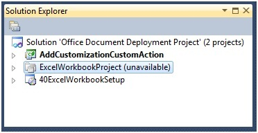

    **Figure 13: Unloading Excel Document Solution**

4. In the **Solution Explorer**, right-click **ExcelWorkbookProject** and click **EditExcelWorkbookProject.vbproj** or **Edit ExcelWorkbookProject.csproj**.
5. In the **ExcelWorkbookProject** editor, locate the **SolutionID** element inside the **PropertyGroup** element.
6. Copy the GUID value of this element.

    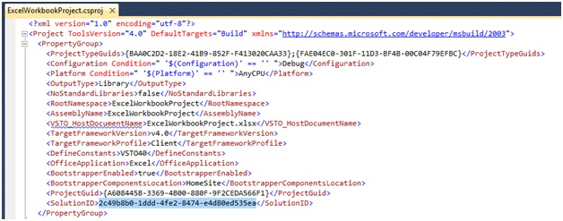

    **Figure 14: Retrieving the SolutionID**

7. In the **Solution Explorer**, right-click **ExcelWorkbookProject** and click **Reload Project**.
8. Click **Yes** in the dialog box that appears to close the **ExcelWorkbookProject** editor.
9. The **Solution ID** will be used in the Install Custom Action.

The last step is to configure the custom action for the **Install** and **Uninstall** steps.

### To configure the setup project

1. In the **Solution Explorer**, right-click **ExcelWorkbookSetup**, expand **Add** and click **Project Output**.
2. In the **Add Project Output Group** dialog box, in the **Project** list, click **AddCustomizationCustomAction**.
3. Select **Primary Output** and click **OK** to close the dialog box and add the assembly containing the custom action to the setup project.

    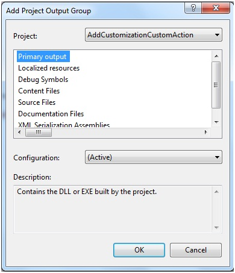

    **Figure 15: Document Manifest Custom Action - Add Project Output Group**

4. In the **Solution Explorer**, right-click **ExcelWorkbookSetup**.
5. Expand **View** and click **Custom Actions**.
6. In the **Custom Actions(ExcelWorkbookSetup)** editor, right-click **Custom Actions** and click **Add Custom Action**.
7. In the **Select Item in Project** dialog box, in the **Look In** list, click **Application Folder**. Select **Primary Output from AddCustomizationCustomAction(active)** and click **OK** to add the custom action to the Install step.
8. Under the **Install node**, right-click **Primary output from AddCustomizationCustomAction(Active)**, and click **Rename**. Name the custom action **Copy document to My Documents and attach customization**.
9. Under the **Uninstall node**, right-click **Primary output from AddCustomizationCustomAction(Active)** and click **Rename**. Name the custom action **Remove document from the Documents folder**.

    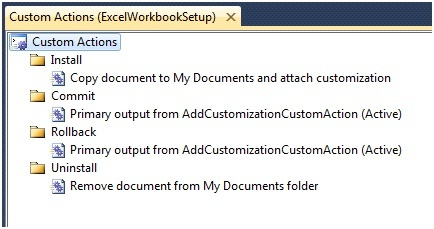

    **Figure 16: Document Manifest Custom Actions**

10. In the **Custom Actions(ExcelWorkbookSetup)** editor, right-click **Copy document to My Documents and attach customization** and click **Properties Window**.
11. In the **CustomActionData** **Properties** window, enter the location of the customization DLL, the deployment manifest, and the location of the Microsoft Office document. The SolutionID is also needed.
12. If you wish to log any setup errors to a file, include a LogFile parameter.
s
    ``` text
    /assemblyLocation="[INSTALLDIR]ExcelWorkbookProject.dll" /deploymentManifestLocation="[INSTALLDIR]ExcelWorkbookProject.vsto" /documentLocation="[INSTALLDIR]ExcelWorkbookProject.xlsx" /solutionID="Your Solution ID" /LogFile="[TARGETDIR]Setup.log"
    ```

    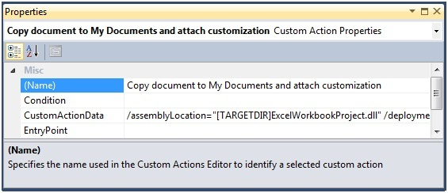

    **Figure 17: Custom Action to Copy Document to My Documents**

13. The Custom Action for Uninstall needs the name of the document, you can provide that by using the same documentLocation parameter in the **CustomActionData**

    ``` text
    /documentLocation="[INSTALLDIR]ExcelWorkbookProject.xlsx"
    ```

14. Compile and deploy the **ExcelWorkbookSetup** project.
15. Look in **My Documents** folder, and open the ExcelWorkbookProject.xlsx file.

## Additional Resources

[How to: Install the Visual Studio Tools for Office Runtime](how-to-install-the-visual-studio-tools-for-office-runtime-redistributable.md)

[Office Primary Interop Assemblies](office-primary-interop-assemblies.md)

[Registry entries for VSTO Add-ins](registry-entries-for-vsto-add-ins.md)

[Custom Document Properties Overview](custom-document-properties-overview.md)

[Specifying Form Regions in the Windows Registry](/office/vba/outlook/concepts/creating-form-regions/specifying-form-regions-in-the-windows-registry)

[Granting Trust to Documents](granting-trust-to-documents.md)

## About the Authors

Wouter van Vugt is a Microsoft MVP with Office Open XML technologies and an independent consultant focusing on creating Office Business Applications (OBAs) with SharePoint, Microsoft Office, and related .NET technologies.
Wouter is a frequent contributor to developer community sites such as [MSDN](/previous-versions/office/developer/office-2007/bb879915(v=office.12)). He has published several white papers and articles as well a book available on line titled Open XML: Explained e-book.
Wouter is the founder of Code-Counsel, a Dutch company focusing on delivering cutting-edge technical content through a variety of channels. You can find out more about Wouter by reading his blog.

Ted Pattison is a SharePoint MVP, author, trainer and the founder of Ted Pattison Group. In the fall of 2005, Ted was hired by Microsoft's Developer Platform Evangelism group to author the Ascend developer training curriculum for Windows SharePoint Services 3.0 and Microsoft Office SharePoint Server 2007. Since that time, Ted has been entirely focused on educating professional developers on SharePoint 2007 technologies. Ted has finished writing a book for Microsoft Press titled Inside Windows SharePoint Services 3.0 that focuses on how to use SharePoint as a development platform for building business solutions. Ted also writes a developer-focused column for MSDN Magazine titled Office Space.
